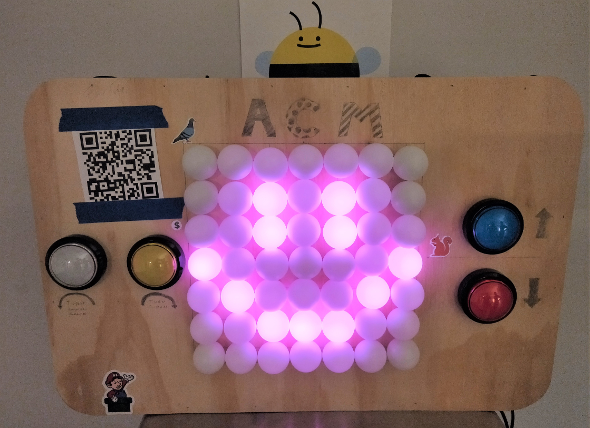

# LED Matrix Console

Contribute your game to the LED Matrix Console! Submit a pull request with your own game classes and updated `Console.ino` for us to feature **your** game! This README summarizes the 3 key header files needed to jump into writing a new game so the console can run it! There is much leeway as to how a game can be implemented and we have provided a `Grid` object that abstracts from the game any display logic.

Built using the [FastLED](https://github.com/FastLED/FastLED) Arduino library :)



## Contribution Guidelines

Two main classes of 'Games' exist on the Console: *Animations* and *Games*. A Game requires interaction with the buttons and implementation of two more functions, `action` and `draw_led`. On the other hand, an Animation does not provide interactivity with buttons and is comparatively simplier. Both types inherits from the base class `Game` in `Game.h`.

Few modifications are needed within the main `Console.ino` file, to enable your Game to be seen by the main control loop, additions need to be made following the `//CONTRIB:` tags in `Console.ino`.

```cpp
#include "Animate.h"
//CONTRIB: Include other headers for different games
#define DIMS 7
#define NUM_LEDS 50
```

```cpp
// Game Types
#define NUM_MODES 2 //IMPT! Need to prevent overflow of cycling
#define SPECTRUM 0
#define SNAKE 1
#define ACM 2
//CONTRIB: Increment NUM_MODES and add your ENUM to the list!
```

```cpp
void spawn_game(int GAME){
  switch(GAME){
    ...
    //CONTRIB: Remember to add in your game below!
//    case YOUR_GAME:
//      delete cur_game;
//      cur_game = new YOUR_GAME(DIMS,disp_grid);
//      break;
    default:
      break;
  }
}
```

## Games

For a prototypical Game, look into [Snakes.h](Console/Snakes.h), games largely just require the following declarations:

```cpp
class Snakes: public Game{
  protected:
    // Grid object for us to interact with main LED display
    Grid* g;

  public:
    // Importantly, the only constructor we need/should declare
    // is the following (int,Grid*) type - Inheritance handles the rest
    Snakes(int d, Grid* ig);
    
    // Do nothing destructor (do not call delete on g)
    // open issue, need to migrate to some form of shared_ptr design
    virtual ~Snakes();
    
    // Main play function called by Console.ino on every loop
    // passes the current time for game to keep track of and use
    bool play(unsigned long cur_time);

    // Function is called from Console.ino whenever a button has been
    // pressed. Passes the button pin as argument, see #define in Game.h
    // where we have pre-defined UP/DOWN/LEFT/RIGHT buttons to correspond
    // correctly with hardware.
    void action(int act_id);

    // Callback from Grid object to request for a customizable color value
    // for each logical value stored in grid's 2D int array
    void draw_led(CHSV* led, int val);
}
```

## Animations

For a prototypical Animation, look into [Animate.h](Console/Animate.h), as it similarly inherits from `Game`, declaration follows similar struction:

```cpp
class Animate_Spectrum: public Game{
  protected:
    // Grid object for us to interact with main LED display
    Grid* g;

  public:
    // Similar to Snakes.h, only declare and define this constructor
    Animate_Spectrum(int d, Grid* ig);

    // Do not delete g (or set its value to 0 first)
    ~Animate_Spectrum();

    // Called every loop by Console.ino, mainly just used to defer logic
    // to some internal function and keep track of time
    bool play(unsigned long cur_time);

    // Stub function, requires definition but does nothing
    void action(int act_id);

    // Similar stub function, does not need to do anything
    void draw_led(CHSV*,int);
};
```

## Grid

Bridging the game logic and actual LED display is the helper `Grid` object which stores two 2D arrays: `int* grid` and `CHSV** grid_col`, an integer array and array of pointers to `CHSV` structs respectively. `CHSV` is a color struct provided by the `FastLED` library to store colors encoded in the Hue-Saturation-Value format (largely chosen so we can cycle through pretty colors gradually).

```cpp
class Grid{
  private:
    // Object pointers for required interaction
    Game* game;
    int* grid;
    CHSV** grid_col;

    // Out-Of-Bounds tracking
    int dims;
    int grid_size;

    // Helper function to serialize grid coordinates
    int idx(int r, int c);

  public:
    // Keeps track of Game object to use the draw_led(CHSV*,int) function
    Grid(int d, Game* ig);

    // Properly frees up heap usage
    ~Grid();
    
    // Logical manipulation
    int get(pos& p);
    int get(int r, int c);
    void set(pos& p, int val);
    void set(int r, int c, int val);
    // Display manipulation
    CHSV* get_col(pos& p);
    CHSV* get_col(int r, int c);
    void set_col(pos& p, CHSV& col);
    void set_col(int r, int c, CHSV& col);
    // Board Utils
    void clear();
    void setall(int val);
    void setall_col(CHSV& col);
    void update_game(Game* g);  // Called within Console.ino to reuse Grid objects
    // Convenient Drawings
    void emoji_smile();
    void emoji_frown();
};
```